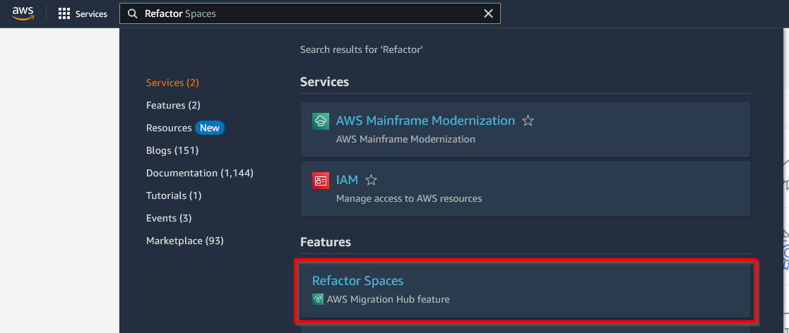
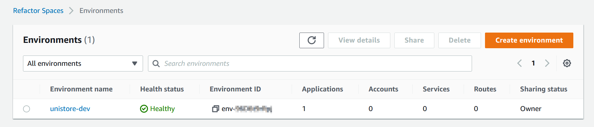
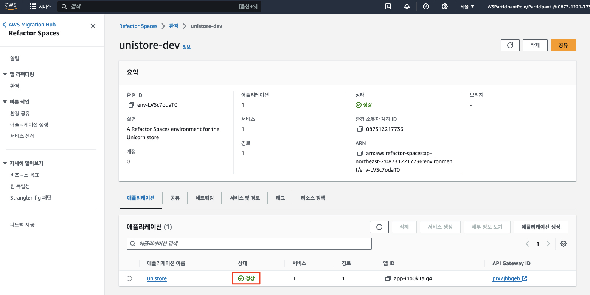
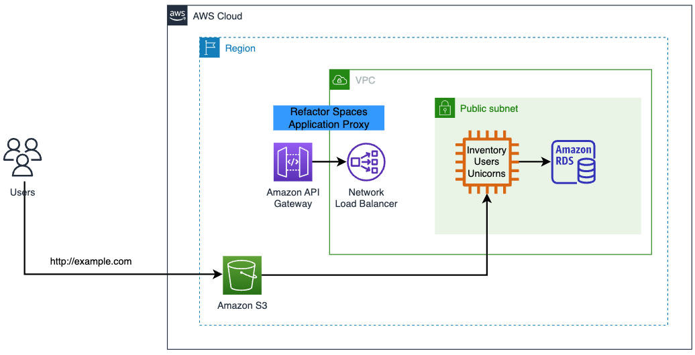
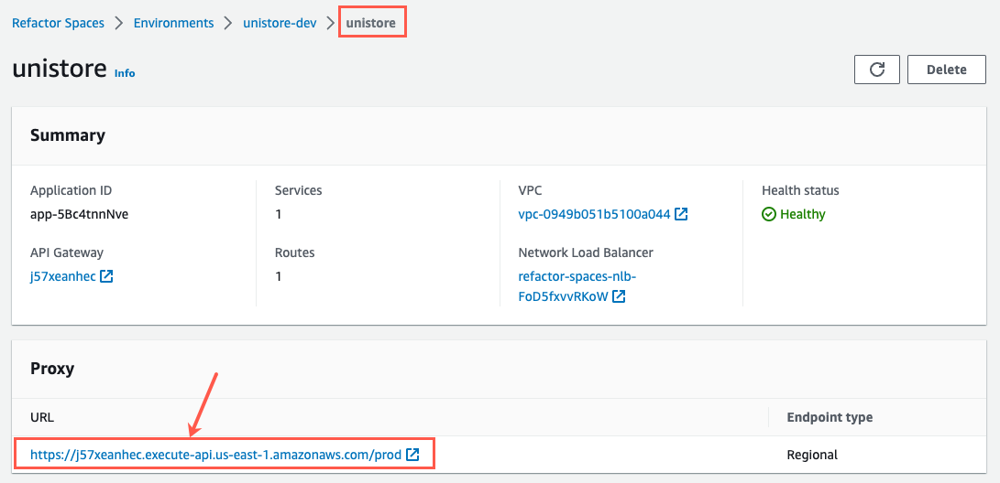
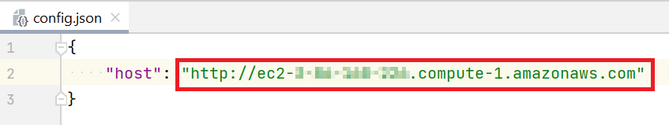
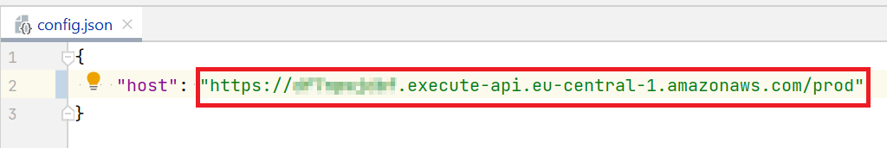
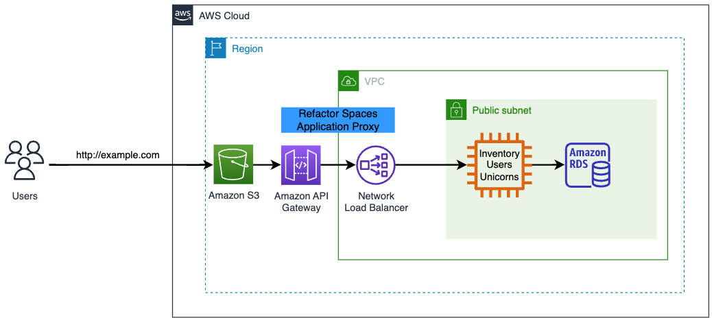

# <p align="center">`리팩터 스페이스 (Refactor Spaces)` 구축</p>

이번 모듈에서는 `AWS Migration Hub Refactor Spaces`를 사용하여 레거시 애플리케이션의 기능을 대체하고 대체 마이크로서비스로 트래픽을 라우팅할 수 있는 환경을 생성합니다 (`스트랭글러 피그 패턴 (Strangler Fig Pattern)`).

다음과 같은 리소스를 생성하게 됩니다.

* `Refactor Spaces 환경 (Refactor Spaces Environment)`은 `Refactor Spaces 애플리케이션 (Application)` 및 관련 인프라 리소스의 컨테이너입니다. `환경`은 점진적으로 현대화하는 데 필요한 인프라, 멀티 계정 네트워킹, 라우팅을 제공하며, 여러 AWS 계정에 걸친 네트워킹, 애플리케이션, 서비스에 대한 통합 뷰를 제공합니다. `Refactor Spaces`는 또한 브리지된 `가상 사설 클라우드 (VPC)`로 구성된 `멀티 계정 네트워크 패브릭`을 조정합니다. 이렇게 하면 패브릭 내의 리소스가 사설 IP 주소를 통해 상호 작용할 수 있습니다.

* `Refactor Spaces 애플리케이션 (Refactor Spaces Application)`은 `서비스 (Service)`와 `라우트 (Route)`의 컨테이너이며, 애플리케이션을 외부 호출자에게 노출하는 단일 외부 엔드포인트를 제공합니다. `Refactor Spaces 애플리케이션`은 `Strangler Fig 패턴`을 모델링하고 `Amazon API Gateway`, `API Gateway VPC 링크`, `Network Load Balancer`, `리소스 기반 IAM 정책`을 조정하여 애플리케이션의 `HTTP 엔드포인트`에 새로운 서비스를 투명하게 추가할 수 있습니다. 또한 기존 애플리케이션에서 새로운 서비스로 트래픽을 점진적으로 라우팅합니다. 이렇게 하면 애플리케이션 소비자에게 기본 아키텍처 변경이 투명하게 유지됩니다. `스트랭글러 피그 패턴`에 대한 자세한 정보는 `마틴 파울러 (Martin Fowler)` [[Strangler Fig Proxy]](https://martinfowler.com/bliki/StranglerFigApplication.html)를 참조하십시오.

* `Refactor Spaces 서비스 (Refactor Spaces Services)`는 고유한 엔드포인트를 통해 접근할 수 있는 서비스입니다. 서비스 엔드포인트는 다음 두 가지 유형 중 하나입니다: `HTTP(S) URL` 또는 `AWS Lambda 함수`. 이 예제에서는 두 가지 서비스가 있습니다:
    1. 레거시 서비스는 기존의 모놀리식을 나타냅니다. 기본적으로 모든 트래픽은 모놀리식으로 라우팅됩니다.
    2. `장바구니` 서비스는 쇼핑 카트 기능을 나타냅니다.

[//]: # (* `Refactor Spaces`는 `URL 서비스`에 대한 DNS 질의를 해석하고 DNS 항목이 변경될 때 `NLB`를 자동으로 업데이트합니다.)

---

## `리팩터 스페이스 환경 생성`

이 섹션에서는 다음과 같은 작업을 수행합니다.

1. `리팩터 스페이스 환경`을 생성합니다.
2. `리팩터 스페이스 환경`과 `애플리케이션`을 확인합니다. 여기에는 다음과 같은 4가지 주요 구성 요소가 포함됩니다:
   1. 환경 
   2. 애플리케이션 
   3. 서비스 
   4. 라우트

우리는 먼저 `CloudFormation`을 사용하여 `환경`과 `애플리케이션`을 생성하도록 하겠습니다.

```bash
cd ~/environment/refactor-workshop/infrastructure-cloudformation

# 리팩터 스페이스 CloudFormation 스택 배포
aws cloudformation deploy --stack-name refactor-space \
    --template-file ./refactor-space-foundation.yaml \
    --capabilities CAPABILITY_NAMED_IAM
```

`CloudFormation` 스택 생성이 완료되면 `Refactor Spaces` 콘솔로 이동하여 `환경` 및 `애플리케이션`을 확인합니다.

1. 서비스 검색 창에 `Refactor Spaces`를 입력하고, 제시되는 서비스 중 `AWS Migration Hub Refactor Spaces`로 이동합니다. 



2. `unistore-dev`라는 이름의 `환경`이 존재하는지 확인합니다. 이 환경이 앞서 `CloudFormation`을 사용하여 계정에 배포된 자원입니다.



3. 환경을 클릭하고 환경 내에 unistore라는 이름의 애플리케이션을 확인합니다. 애플리케이션의 상태는 `정상 (Healthy)` 상태로 표시되어야 합니다.



리팩터 환경의 현재 상태는 다음 다이어그램과 같습니다.<br>


> 아직 `Refactor Spaces`를 통한 사용자 트래픽은 없습니다.

---

## `서비스 생성`

이 섹션은 다음을 수행합니다.

* 레거시 백엔드 애플리케이션을 위한 `Refactor Spaces 서비스`를 확인합니다.
* 모든 기존 트래픽을 애플리케이션 프록시 (`API Gateway`)를 통해 `레거시 서비스`로 라우팅합니다.

### 레거시 애플리케이션을 위한 `Refactor Spaces` 서비스 확인

> 우리는 이미 `CloudFormation`을 사용하여 계정에 배포한 `Refactor Spaces`에는 레거시 `서비스`도 포함되어 있으며 이름은 `legacy`입니다.

`Refactor Space` 내의 `legacy` 서비스는 기존의 모놀리스를 나타냅니다. 현재 우리의 목표는 서비스를 현재의 모놀리스의 백엔드 엔드포인트 URL (에: http://ec2-XXX-XXX-XXX-XXX.compute-1.amazonaws.com/, `모듈 1`에서 확인했던 `PulbicDns`)을 가리키도록 설정하는 것입니다. 이 `Refactor 서비스`는 모놀리스로의 모든 트래픽을 전달하는 새로운 프록시로 작동할 것입니다. (사실 이미 이렇게 구셩되어 있으며 여기서는 이를 확인하도록 합니다).

1. `AWS Migration Hub Refactor Spaces`로 이동하여 `unistore-dev` 환경을 선택합니다.

2. 환경 내에서 `unistore` `애플리케이션`을 선택합니다.

3. 이미 생성된 서비스 1개가 생성되어 있고 이름이 `legacy`인지 확인합니다. 서비스를 선택하여 상세 페이지로 이동합니다.


이 서비스는 [[`모듈 1`의 `PublicDns` 확인]](https://github.com/shkim4u/aws-refactor-space-workshop-ko-kr/blob/e4bdc3e2ac518546bb2ba01cce4cdc2d787e8253/docs/monolith-application.md#L39-L39) 단계에서 확인한 모놀리스 백엔드 서버로 구성된 서비스 엔드포인트를 가지고 있음을 확인하세요.

> (참고) 다음 `CloudFormation` 용 `AWS CLI` 명령을 사용하여 확인할 수도 있습니다.
> ```bash
> PUBLIC_DNS=`aws cloudformation describe-stacks --stack-name legacy-monolith --query "Stacks[0].Outputs[?OutputKey=='PublicDns'].OutputValue" --output text` && echo $PUBLIC_DNS
> ```

또한, 모든 트래픽을 해당 서비스 엔드포인트 URL로 보내는 하나의 라우트가 구성되어 있습니다. 이 서비스 프록시는 `Amazon API Gateway`를 사용하여 구현되었습니다.

### 모든 기존 트래픽을 애플리케이션 프록시를 통해 레거시 서비스로 라우팅

이제 애플리케이션 프록시 리소스가 사용 가능하므로, `Amazon S3`에서 호스팅되는 `프론트엔드 웹사이트`의 백엔드 엔드포인트를 `Refactor Spaces`가 생성한 새로운 엔드포인트를 사용하도록 설정하겠습니다. 이를 위해, 우리는 프론트엔드 애플리케이션의 `config.json` 파일을 새 엔드포인트의 URL로 업데이트하겠습니다.

1. 애플리케이션 프록시 URL 가져오기 - `Refactor Space` 내의 `unistore` 애플리케이션으로 한 단계 위로 이동합니다. `프록시 URL`을 선택하고 URL을 복사합니다.



2. 설정 파일 수정 - 이제 백엔드를 위한 새 URL을 사용하도록 프론트엔드 설정 파일을 수정해야 합니다. 설정 파일은 프론트엔드 웹사이트를 호스팅하는 S3 버킷에 위치해 있습니다. `Amazon S3` 서비스로 이동하고, `legacy-monolith-uibucket-xxxxx` (여기서 xxxxx는 CloudFormation에 의해 생성된 무작위 문자열)라는 이름의 버킷을 엽니다.

3. `config.json` 파일을 로컬 머신으로 다운로드합니다.

4. 새로 다운로드한 `config.json` 파일을 열고 위 1에서 복사한 `unistore` 프록시 URL로 호스트 URL을 교체한 후 파일을 저장합니다.



> (주의)<br>
> "host" 값을 교체할 때 URL이 HTTPS (HTTP가 아닌)를 사용하는지 확인하세요.



5. 설정 파일 업로드 - `Amazon S3` 버킷 콘솔로 이동하고, 업로드 버튼을 클릭하여 수정된 `config.json` 파일을 `S3 정적 웹사이트`로 다시 업로드합니다.

이제 우리는 설정 파일의 URL을 업데이트했으므로, 애플리케이션은 프록시되어 다음과 같이 구성되게 됩니다.



> (참고)<br>
> 이 다이어그램은 좀 더 설명을 필요로 하는 부분이 있습니다. 진행자와 함께 다이그램을 구성하는 AWS 리소스를 좀 더 살펴보도록 합니다.   

6. 웹사이트 테스트 - `Unishop` 웹사이트가 여전히 작동하는지 확인하기 위해 프론트엔드를 테스트해 봅시다. 브라우저를 열고 `Unishop URL`로 이동합니다 (아래 CLI 명령 사용). 브라우저의 개발자 콘솔을 보면 새 프록시 호스트를 볼 수 있습니다.
```bash
WEBSITE_URL=`aws cloudformation describe-stacks --stack-name legacy-monolith --query "Stacks[0].Outputs[?OutputKey=='WebsiteURL'].OutputValue" --output text` && echo $WEBSITE_URL
```

> (참고)<br>
> API Gateway 엔드포인트로 전환한 후 유니콘을 볼 수 없는 경우, 웹 브라우저에서  "새로 고침"을 수행한 후 다시 시도해 보세요.

---

## 요약

이번 모듈에서는 `AWS Migration Hub Refactor Spaces`를 사용하여 유연한 라우팅 제어, 격리, 중앙 집중식 관리를 통해 레거시 애플리케이션과 마이크로서비스를 단일 애플리케이션으로 관리할 수 있는 환경을 생성했습니다.

다음 모듈에서는 모놀리스의 `장바구니` 기능을 대체할 새로운 마이크로서비스를 생성할 것입니다. 그런 다음 `Migration Hub Refactor Spaces` 프록시를 사용하여 쇼핑 카트에 대한 트래픽을 새로운 마이크로서비스로 리디렉션하겠습니다.
