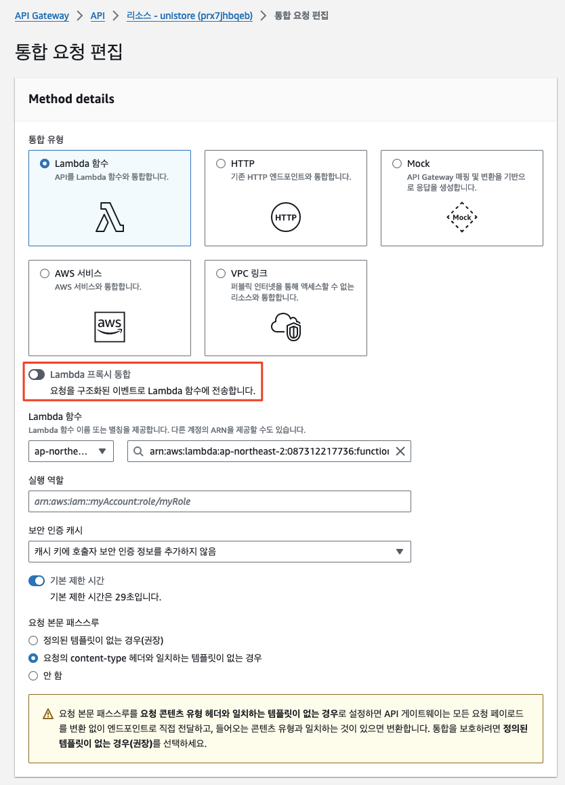
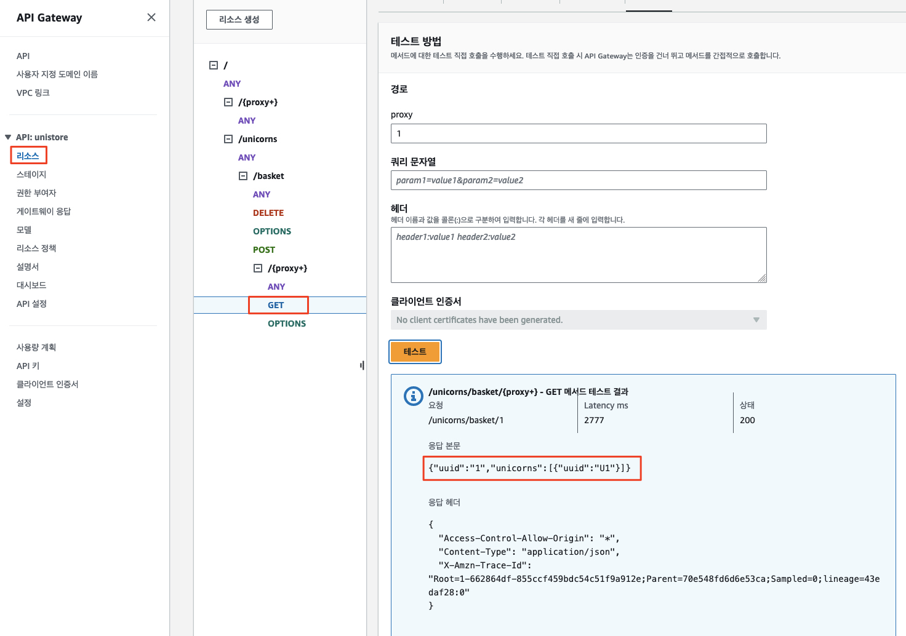

# <p align="center">`장바구니 (쇼핑 카트)` 마이크로서비스 분리</p>

이 모듈에서는 `AWS Lambda`와 `AWS DynamoDB`를 사용하여 `장바구니` 기능을 마이크로서비스로 분리할 것입니다. 그런 다음 `리팩터 스페이스`를 구성하여 `장바구니`에 대한 트래픽을 모놀리스에서 새로운 마이크로서비스로 라우팅하겠습니다. 마지막으로, `Strangler Fig 패턴`을 사용하여 `Unishop` 웹사이트의 모든 기능이 원활하게 작동하는지 테스트하겠습니다.


---

## `Amazon DynamoDB`

우선 분리되는 마이크로서비스가 사용할 `DynamoDB` 테이블을 생성하도록 하겠습니다 (Polyglot 데이터베이스).

```bash
cd ~/environment/refactor-workshop/infrastructure-cloudformation

# 장바구니 데이터베이스 (DynamoDB) CloudFormation 스택 배포
aws cloudformation deploy --stack-name shopping-cart-dynamodb \
    --template-file ./microservice-dynamodb.yaml \
    --capabilities CAPABILITY_NAMED_IAM
```

마이크로서비스 아키텍처를 사용하면 해당 마이크로서비스의 기능 구현에 다양한 기술을 선택할 수 있는 자유를 얻게 됩니다 (`Polyglot`). 우리는 `장바구니` 마이크로서비스의 데이터베이스로 [[`Amazon DynamoDB`]](https://aws.amazon.com/dynamodb/)를 사용할 것입니다. `DynamoDB`는 `장바구니` 정보를 저장하고 빠른 읽기와 쓰기를 가능하게 하는 `키/값 (Key/Value)` 저장소입니다.

위의 자원 생성이 완료되면 `unishop`이라는 이름의 DynamoDB 테이블이 만들어집니다.

1. `AWS DynamoDB` 콘솔로 이동합니다.

2. `DynamoDB` 테이블 확인<br>


---

## `AWS Lambda`

이번에는 실제 마이크로서비스 기능의 구현체가 담긴 `AWS Lambda` 함수를 생성하도록 하겠습니다.

[[`AWS Lambda`]](https://aws.amazon.com/lambda/)는 인프라를 프로비저닝하거나 관리하지 않고 코드를 실행할 수 있는 서버리스 컴퓨팅 서비스입니다. 우리는 `AWS Lambda`를 사용하여 `장바구니` 서비스에 필요한 3개의 함수를 배포할 것입니다.

* `AddUnicornToBasket`
* `GetUnicornBasket`
* `RemoveUnicornFromBasket`

아래 명령을 실행하여 `AWS Lambda` 함수로 구현된 마이크로서비스를 배포합니다.

```bash
cd ~/environment/refactor-workshop/infrastructure-cloudformation

# 장바구니 데이터베이스 (DynamoDB) CloudFormation 스택 배포
aws cloudformation deploy --stack-name shopping-cart-lambda \
    --template-file ./microservice-lambda.yaml \
    --capabilities CAPABILITY_NAMED_IAM
```

1. `AWS Lambda` 콘솔로 이동합니다.

2. 3개의 `AWS Lambda` 함수 확인


> (참고)
> 진행자와 함께 `AWS Lambda` 코드를 좀 더 살펴 봅니다.
>```bash
>cd ~/environment
>c9 open ./MonoToMicro/MonoToMicroLambda/src/main/java/com/monoToMicro/Lambda/UnicornBasketImpl.java
>```

---

## `장바구니` 서비스

`Lambda 함수`와 `DynamoDB`가 배포된 이후, 다음 단계는 새로운 모놀리스가 아닌 마이크로서비스로 트래픽을 라우팅할 수 있게 해주는 `Refactor Spaces 서비스`를 생성하는 것입니다. 우리는 `장바구니` 트래픽을 라우팅하기 위해 다음 서비스를 해당 `Lambda 함수`와 함께 구성할 것입니다.

| `리팩터 스페이스 서비스` | `람다 함수`              | 설명            |
|--------------|----------------------|---------------|
| `AddToCartService`   | `AddUnicornToBasket`   | 장바구니에 유니콘 추가  |
| `RemoveCartService`  | `RemoveUnicornFromBasket` | 장바구니에서 유니콘 제거 |
| `GetCartService`        | `GetUnicornBasket`             | 장바구니 아이템 가져오기 |

### <u>***`장바구니 추가` 서비스***</u>

쇼핑 카트에 유니콘을 추가하는 트래픽을 새로운 `AddUnicornToBasket` `Lambda 함수`로 라우팅합니다.

`AddUnicornToBasket` `Lambda 함수`로 트래픽을 라우팅하기 위해, 우리는 `AddToCartService`라는 이름의 `Refactor Spaces 서비스`를 생성할 것입니다. 이 `Refactor Spaces 서비스`는 자동으로 API Gateway를 구성하여 트래픽을 모놀리스에서 `AddUnicornToBasket` `Lambda 함수`로 라우팅합니다.

1. `Refactor Spaces` 페이지로 돌아가서 `빠른 작업 (Quick actions)` 메뉴의 `서비스 생성 (Create service)`을 선택합니다.


2. `AddToCartService`를 생성합니다:
   * 애플리케이션 선택
     * 환경: `unistore-dev`
     * 애플리케이션: `unistore`
   * 서비스 세부 정보
     * 서비스 이름: ```AddToCartService```
   * 서비스 엔드포인트 구성
     * 서비스 엔드포인트 유형: `Lambda`
     * 람다 함수: `AddUnicornToBasket`
   * 이 서비스로 트래픽 라우팅 
     * 소스 경로: ```/unicorns/basket```
     * 하위 경로 포함: `체크 해제`
     * 메서드: `POST` ("모두 일치" 체크 해제)
     * `이 경로를 활성 상태로 생성` 체크

<br>
<br>

3. `서비스 생성` 클릭

`리팩터 스페이스 서비스` `AddToCartService`가 정상적으로 생성되면 `API Gateway` 리소스가 자동으로 만들어집니다.

`API Gateway` 콘솔로 이동하여 이를 확인해 봅니다.


### <u>***`장바구니 삭제` 서비스***</u>

마찬가지 방법으로 `장바구니` 아이템 삭제 트래픽을 새로운 `RemoveUnicornFromBasket` `Lambda 함수`로 라우팅합니다.

새로운 `RemoveUnicornFromBasket` `Lambda 함수`로 트래픽을 라우팅하기 위해, `RemoveCartService`라는 이름의 `Refactor Spaces 서비스`를 생성할 것입니다. 이 `Refactor Spaces 서비스`는 자동으로 `API Gateway`를 구성하여 관련 트래픽을 모놀리스에서 `RemoveUnicornFromBasket` `Lambda 함수`로 라우팅합니다.

1. `Refactor Spaces` 페이지로 돌아가서 `빠른 작업 (Quick actions)` 메뉴의 `서비스 생성 (Create service)`을 선택합니다.

2. `RemoveCartService`를 생성합니다:
    * 애플리케이션 선택
        * 환경: `unistore-dev`
        * 애플리케이션: `unistore`
    * 서비스 세부 정보
        * 서비스 이름: ```RemoveCartService```
    * 서비스 엔드포인트 구성
        * 서비스 엔드포인트 유형: `Lambda`
        * 람다 함수: `RemoveUnicornFromBasket`
    * 이 서비스로 트래픽 라우팅
        * 소스 경로: ```/unicorns/basket```
        * 하위 경로 포함: `체크 해제`
        * 메서드: `DELETE` ("모두 일치" 체크 해제)
        * `이 경로를 활성 상태로 생성` 체크

<br>
<br>

3. 서비스 생성 선택

`리팩터 스페이스 서비스` `RemoveCartService`가 정상적으로 생성되면 앞서 `AddCartService` 생성 시에 함께 만들어진 `API Gateway` 리소스에 `DELETE` 메서드가 추가됩니다.

`API Gateway` 콘솔로 이동하여 이를 확인해 봅니다.


### <u>***`장바구니 조회` 서비스***</u>

`장바구니` 조회 서비스는 전체 `장바구니` 목록의 조회 뿐만 아니라 특정 아이템의 속성에 대한 질의를 처리하기 위한 매개변수 처리가 필요합니다. 따라서 앞선 두 개의 서비스 설정에 비해 조금 복잡하지만 차근차근 진행해 보겠습니다.

다음과 같은 작업이 수행됩니다.

* `장바구니` 아이템 목록을 `GetUnicornBasket` `Lambda 함수`로 라우팅합니다.
* 파라미터 처리를 위한 `API Gateway 모델` 생성
* `GET` 메서드를 위한 `매핑 템플릿` 구성
* 파라미터를 포함한 선별적 호출을 위해 `Lambda 프록시 통합` 비활성화
* 불필요한 GET 메서드 삭제

`장바구니` 목록을 `GetUnicornBasket` `Lambda 함수`로 라우팅하기 위해, 앞선 두 개의 서비스와 마찬가지로 `GetCartService`라는 이름의 `Refactor Spaces 서비스`를 생성할 것입니다. `GetCartService`는 `경로 변수 (uuid)`를 JSON 객체 (Lambda 메서드 시그니처의 일부)로 매핑해야 합니다. 그래서, 우리는 `객체 모델`을 생성하고 `API Gateway`의 `통합 요청`에 대한 `매핑 템플릿`을 구성할 것입니다.

1. `Refactor Spaces` 페이지로 돌아가서 `빠른 작업 (Quick actions)` 메뉴의 `서비스 생성 (Create service)`을 선택합니다.

2. `GetCartService`를 생성합니다:
    * 애플리케이션 선택
        * 환경: `unistore-dev`
        * 애플리케이션: `unistore`
    * 서비스 세부 정보
        * 서비스 이름: ```GetCartService```
    * 서비스 엔드포인트 구성
        * 서비스 엔드포인트 유형: `Lambda`
        * 람다 함수: `GetUnicornBasket`
    * 이 서비스로 트래픽 라우팅
        * 소스 경로: ```/unicorns/basket```
        * 하위 경로 포함: <u>**`체크`**</u>
        * 메서드: `GET` ("모두 일치" 체크 해제)
        * `이 경로를 활성 상태로 생성` 체크

<br>
<br>

3. 서비스 생성 선택

`리팩터 스페이스 서비스` `GetCartService`가 정상적으로 생성되면 앞서 `AddCartService` 생성 시에 함께 만들어진 `API Gateway` 리소스에 `GET` 메서드가 추가됩니다.

`API Gateway` 콘솔로 이동하여 이를 확인해 봅니다.


#### (1) *`API Gateway` 모델 생성*

1. `API Gateway 콘솔`로 이동하여 `리팩터 스페이스`가 생성한 `unistore` API를 클릭합니다.<br>


2. 왼쪽 메뉴의 `모델`을 선택한 후 `생성`을 클릭합니다.<br>


3. 다음 값을 입력합니다
* 모델 이름: ```UnicornBasket```
* 콘텐츠 유형: ```application/json```
* 모델 스키마: 아래 코드를 복사합니다
```json
{
    "$schema": "http://json-schema.org/draft-04/schema#",
    "title": "UnicornBasket",
    "type": "object",
    "properties": {
        "uuid": { "type": "string" }
    }
}
```

4. `생성`을 클릭합니다.


#### (2) *`Lambda 프록시 통합` 비활성화*

이 단계에서는 `GET`, `POST` 및 `DELETE` 메서드에 대해 Lambda 프록시 통합을 비활성화하겠습니다.

`AWS API Gateway`의 `Lambda 프록시 통합`은 클라이언트가 백엔드 `Lambda 함수`를 직접 호출할 수 있게 해주는 기능입니다. 이 기능이 활성화되면, 들어오는 요청 데이터 (헤더, 쿼리 문자열 매개변수, 본문)가 `Lambda 함수`로 직접 전달됩니다. 이 함수는 이 데이터를 입력 매개변수로 받습니다.

Lambda 함수는 다음을 포함하는 출력을 반환해야 합니다:

- `statusCode`: 응답에 대한 HTTP 상태 코드.
- `headers`: 응답에 포함할 HTTP 헤더를 위한 문자열 키-값 쌍의 맵.
- `body`: HTTP 응답의 본문. 이는 문자열이어야 하며, JSON 페이로드가 있는 응답의 경우 Node.js에서 `JSON.stringify()` 또는 다른 언어에서 해당하는 함수를 사용하여 문자열로 변환해야 합니다.
- `isBase64Encoded`: 본문 데이터가 Base64로 인코딩되었는지를 나타내는 부울 플래그.

이 접근 방식은 API Gateway 설정을 단순화하며, 메서드 요청과 메서드 응답 설정의 필요성을 줄입니다. 그러나 이는 또한 `Lambda 함수`가 원시 요청 데이터를 처리하고 올바른 응답 형식을 생성하는 책임을 가지게 됨을 의미합니다.

우리는 앞서 정의한 모델을 사용하여 `API Gateway`가 입력 매개변수를 적절하게 변환하여 `Lambda 함수`로 전달하도록 설정할 것이므로, `Lambda 프록시 통합`을 비활성화해야 합니다.

`API Gateway 콘솔`로 이동하고 `unistore` API를 선택합니다.

1. `GET` 메서드
   1. `API Gateway` 왼쪽 메뉴에서 리소스를 선택합니다. 
   2. 리소스 트리에서 `/unicorns/basket/{proxy+}`의 `GET` 메서드를 선택합니다. 
   3. 오른쪽의 `통합 요청 (Ingegration Request)`을 클릭하고 `편집` 버튼을 클릭합니다.
   
   4. `Lambda 프록시 통합` 사용 체크를 해제하고 `저장`을 클릭합니다.
   
2. `POST` 메서드
   1. `API Gateway` 왼쪽 메뉴에서 리소스를 선택합니다.
   2. 리소스 트리에서 `/unicorns/basket`의 `POST` 메서드를 선택합니다.
   3. 오른쪽의 `통합 요청 (Ingegration Request)`을 클릭하고 `편집` 버튼을 클릭합니다.
   
   4. `Lambda 프록시 통합` 사용 체크를 해제하고 `저장`을 클릭합니다.
   
3. `DELETE` 메서드
   1. `API Gateway` 왼쪽 메뉴에서 리소스를 선택합니다.
   2. 리소스 트리에서 `/unicorns/basket`의 `DELETE` 메서드를 선택합니다.
   3. 오른쪽의 `통합 요청 (Ingegration Request)`을 클릭하고 `편집` 버튼을 클릭합니다.
   
   4. `Lambda 프록시 통합` 사용 체크를 해제하고 `저장`을 클릭합니다.
   

#### (3) *`GET `메서드를 위한 매핑 템플릿 구성*

1. `/unicorns/basket/{proxy+}` 리소스에서 `GET` 메서드를 선택합니다

2. `통합 요청 (Integration Request)` > `편집 (Edit)`을 클릭하고 `요청 본문 패스스루` 부분에 `정의된 템플릿이 없는 경우(권장)`을 선택하고 매핑 템플릿`을 확장합니다.


3. `매핑 템플릿`을 구성합니다 
   1. `콘텐츠 유형`: ```application/json```
   2. `템플릿 생성`: 드롭다운 목록에서 `UnicornBasket` 선택 
   3. `템플릿 본문`의 텍스트를 다음으로 교체하고 저장을 클릭합니다:
   ```vtl
   #set($inputRoot = $input.path('$'))
   {
      "uuid" : "$input.params('proxy')"
   }
   ```
    

   > (참고) 위 `VTL (Velocity Template Library)` 템플릿은 다음과 같은 의미를 가지고 있습니다.<br><br>
   > 이 AWS API Gateway의 VTL (Velocity Template Language) 템플릿은 클라이언트로부터 받은 요청을 Lambda 함수가 처리할 수 있는 형태로 변환하는 역할을 합니다.<br>
   > 
   > `#set($inputRoot = $input.path('$'))`는 입력 요청의 본문을 `$inputRoot` 변수에 저장하는 구문입니다. `$input.path('$')`는 전체 요청 본문을 가져옵니다. 
   > 
   > 그 다음에 있는 JSON 객체는 변환된 요청 본문을 정의합니다. 이 객체는 `uuid`라는 키를 가지며, 그 값은 `$input.params('proxy')`로 설정됩니다. `$input.params('proxy')`는 요청 URL의 경로 변수 'proxy'의 값을 가져옵니다.
   > 
   > 따라서, 이 템플릿은 요청 URL의 'proxy' 경로 변수 값을 'uuid'라는 키의 값으로 가지는 JSON 객체를 생성하고, 이 객체를 Lambda 함수에 전달합니다.

4. `저장`을 클릭합니다.


#### (4) 불필요한 GET 메서드 삭제

우리는 조회를 위해 `/unicorns/basket` 뒤에 오는 경로 변수에만 관심이 있으므로 `/unicorns/basket`의 `GET` 메서드를 삭제하고 `/unicorns/basket/{proxy+}`의 메서드만 남겨둡니다.

1. `/unicorns/basket`의 `GET` 메서드를 선택합니다.

2. `삭제`를 선택하고, 그 후에 나오는 대화 상자에서 `확인`을 클릭합니다.


### 서비스 `API Gateway` 배포

이제 `API Gateway`를 배포함으로써 변경 사항을 적용할 수 있으며, 아래와 같은 작업을 수행하면 됩니다.
* 메서드 응답 코드 구성 
* `Cross-Origin Resource Sharing (CORS)` 활성화 
* API 배포

#### (1) `GET`, `POST` 및 `DELETE` 메서드 응답 구성

1. `/unicorns/basket/{proxy+}`에 대한 GET 메서드의 API 리소스를 선택하고 `메서드 응답 (Method Response)`를 클릭합니다.


2. `응답 생성 (Add Response)` 를 클릭하고 `HTTP` 상태 코드 텍스트 상자에 `200`을 입력한 후 `저장` 클릭합니다.
<br>


3. 마찬가지로 `/unicorns/basket` 리소스 경로의 `POST` 메서드의 `메서드 응답 (Method Response)`을 선택하고 같은 작업을 수행해 줍니다.

4. `/unicorns/basket`의 `DELETE` 메서드의 `메서드 응답 (Method Response)`에 대해서도 같은 작업을 수행해 줍니다.

#### (2) `Cross-Origin Resource Sharing (CORS)` 활성화
마지막 구성은 `CORS`를 활성화하는 것입니다. 프론트엔드와 API의 도메인이 다르기 때문입니다. 이 작업은 `/unicorns/basket` 및 `/unicorns/basket/{proxy+}` 리소스에서 수행해야 합니다.

> (참고)<br>
> 사실 `CORS` 설정은 레거시 모놀리스 어플리케이션에서도 설정되어 있습니다. 왜냐면 레거시 `백엔드` API의 도메인도 `프론트엔드`의 그것과 달랐기 때문입니다.
> 
> 아래 파일을 열어봄으로써 이를 확인할 수 있습니다.
> ```bash
> cd ~/environment
> c9 open ./MonoToMicro/MonoToMicroLegacy/src/main/java/com/monoToMicro/config/MVCConfig.java
> ```
> 
> 
> 
> 이 Java 파일은 `Spring Framework`를 사용하여 웹 애플리케이션의 설정을 정의하는 구성 클래스입니다. 클래스에는 다음과 같은 주요 구성 요소와 기능이 포함되어 있습니다.
> 1. `@Configuration`: 이 어노테이션이 붙은 클래스는 `Spring`의 Java 기반 `구성 클래스`로 간주됩니다. 이 클래스는 Spring `IoC 컨테이너`에 의해 빈 정의를 생성하고 관리하는 데 사용됩니다.
> 2. `@EnableWebMvc`: 이 어노테이션은 `Spring MVC`를 활성화합니다. 이것은 `Spring`의 `DispatcherServlet` 설정을 활성화하고 기본으로 설정된 `Spring MVC` 구성을 사용하도록 합니다.
> 3. `@ComponentScan`: 이 어노테이션은 Spring이 빈을 찾을 위치를 지정합니다. 이 경우, "com.monoToMicro.rest.controller"와 "com.monoToMicro.core" 패키지가 스캔 대상입니다.  `@ComponentScan` 어노테이션은 Spring Framework에게 특정 패키지를 스캔하도록 지시하여 그 안에 있는 클래스들 중에서 Spring 빈으로 등록할 수 있는 클래스를 찾아내는 역할을 합니다.  이 어노테이션에 지정된 패키지와 그 하위 패키지에서 @Component, @Service, @Repository, @Controller 등의 어노테이션이 붙은 클래스를 찾아서 ApplicationContext에 빈으로 등록합니다. 이렇게 등록된 빈들은 애플리케이션에서 필요로 할 때 Spring에 의해 주입되어 사용됩니다.  예를 들어, @ComponentScan(basePackages = { "com.monoToMicro.rest.controller","com.monoToMicro.core" })라는 코드는 "com.monoToMicro.rest.controller"와 "com.monoToMicro.core" 패키지와 그 하위 패키지를 스캔하도록 지시합니다. 이 패키지들 안에 있는 `@Component`, `@Service`, `@Repository`, `@Controller` 등의 어노테이션이 붙은 클래스들이 Spring의 `ApplicationContext`에 빈으로 등록됩니다.
> 4. `MVCConfig` 클래스는 `WebMvcConfigurerAdapter`를 확장합니다. `WebMvcConfigurerAdapter`는 `Spring MVC`의 구성을 사용자 정의하는 데 사용되는 클래스입니다. 이 클래스는 더 이상 사용되지 않으며 (Deprecated) Spring 5에서는 `WebMvcConfigurer` 인터페이스를 구현하는 것이 권장됩니다.
> 5. `addCorsMappings` 메서드는 `CORS(Cross-Origin Resource Sharing)` 설정을 정의합니다. 이 메서드는 모든 경로("/**")에 대해 모든 HTTP 메서드를 허용하는 CORS 정책을 설정합니다. <u>***이렇게 하면 다른 도메인에서 호스팅되는 클라이언트 애플리케이션에서 이 서버로의 요청이 가능해집니다.***</u>

##### `/unicorns/basket` 리소스

1. 트리에서 `/unicorns/basket` 리소스를 선택합니다.

2. `CORS 활성화`를 클릭합니다.


3. `DELETE`, `POST`를 선택하고 `저장`을 클릭합니다.


##### `/unicorns/basket/{proxy+}` 리소스
마찬가지로 `/unicorns/basket/{proxy+}` 리소스의 `GET` 메서드에 대해 `CORS`를 활성화합니다.


#### (3) API 배포

우리가 한 구성 변경 사항은 아직 실시간으로 적용되지 않았으므로 이를 배포해야 합니다.

1. 화면 오른쪽에 있는 `API 배포`를 클릭합니다.


2. `스테이지`에 `prod`를 선택하고 `배포`를 클릭합니다.


---

## 서비스 테스트

이제 우리는 `장바구니` 기능을 새로운 마이크로서비스로 구현하고 해당 기능을 사용하는 경로를 달리하여 마이크로서비스에서 수행되도록 구성하였습니다. 이 모든 것들이 클라이언트에 투명하게 진행되므로 우리는 이를 리팩터링이라고 부릅니다. 이제 이러한 변경 사항이 올바르게 작동하는지 확인해 보도록 하겠습니다.

아래와 같은 작업을 수행할 것입니다.

* 새로운 `장바구니` 서비스를 이용한 `Unishop` 웹사이트 테스트
* `API Gateway`를 직접 사용하여 `장바구니` 서비스 테스트 (선택 사항)

모든 설정이 정상적으로 완료되었다면, 브라우저에서 UI를 새로고침하면 `Unishop`이 평소처럼 로딩되는 것을 볼 수 있을 것입니다. 이 시점에서, 애플리케이션이 프록시 뒤에서 실행되고 있으며, `장바구니` 기능을 사용하는 모든 요청들은 서버리스 서비스인 `API Gateway`, `Lambda`, 그리고 `DynamoDB`에서 실행되는 새로운 마이크로서비스로 라우팅되고 있습니다. 그 외의 모든 요청들은 계속해서 레거시 모놀리스 애플리케이션에서 처리됩니다.


### `Unishop` 웹사이트 테스트

1. 등록에 사용한 이메일 주소로 웹사이트에 로그인합니다. 웹사이트 URL은 정적 웹 호스팅을 제공하는 Amazon S3 버킷에서 찾을 수 있습니다. 혹은 아래 `AWS CLI`를 실행하여 얻을 수 있습니다.
```bash
WEBSITE_URL=`aws cloudformation describe-stacks --stack-name legacy-monolith --query "Stacks[0].Outputs[?OutputKey=='WebsiteURL'].OutputValue" --output text` && echo $WEBSITE_URL
```

2. `장바구니`에 아이템을 추가해 봅니다.

3. `개발자 도구`를 열어 요청이 어디로 가는지 확인합니다. `리팩터 스페이스`를 거치는 새로운 호스트를 볼 수 있어야 합니다.


4. `Lambda 콘솔` > `AddUnicornToBasket` > `모니터링`으로 이동하여 `CloudWatch` 메트릭 및 로그를 볼 수 있습니다.


5. `DynamoDB` 테이블을 열어 아이템을 찾아보고, 데이터베이스에 저장된 `장바구니` 세부 정보를 확인합니다.
<br>
<br>
<br>
<br>
<br>


### `API Gateway`에서 직접 서비스 테스트

메서드에 테스트 호출을 만들어 `API Gateway` 내에서 `장바구니` 서비스를 직접 테스트할 수도 있습니다. 테스트 호출을 만들면, `API Gateway`는 인증을 건너뛰고 바로 메서드를 호출할 수 있습니다.

#### (1) `장바구니`에 유니콘 추가

1. `/unicorns/basket`의 `POST` 메서드에 대한 설정 화면으로 이동합니다.

2. 오른쪽의 "테스트" 탭을 클릭합니다.


3. 테스트 목적으로 로그인한 사용자를 나타내는 `uuid`를 `1`로, `장바구니`에 추가하려는 유니콘을 나타내는 유니콘 `uuid`를 `U1`로 사용하겠습니다. `요청 본문`에 다음 텍스트를 입력하고 `테스트`를 클릭합니다:
   ```json
   {
       "uuid": "1",
       "unicorns": [
           {
               "uuid": "U1"
           }
       ]
   }
   ```
   

4. 유니콘이 `장바구니`에 추가된 응답을 볼 수 있어야 합니다.


#### (2) `장바구니`에 있는 유니콘 아이템 목록 가져오기

1. `/unicorns/basket/{proxy+}`의 `GET` 메서드 > `테스트`를 클릭합니다.


2. 앞서 `장바구니`에 유니콘을 추가했던 사용했던 사용자의 `uuid`가 `1`이었으므로 이 값을 사용하여 테스트합니다. 테스트는 해당 사용자의 `장바구니` 항목을 가져올 것입니다. `경로` 섹션의 `{proxy}`에 대한 텍스트 필드에 `1`을 입력하고 테스트를 클릭합니다.


3. 응답 본문에 다음 내용이 포함된 `장바구니`가 검색되었음을 볼 수 있습니다.<br>
   ```json
   {
     "uuid": "1",
     "unicorns": [
       {
         "uuid": "U1"
       }
     ]
   }
   ```
   

#### (3) `장바구니`에서 유니콘 삭제

1. `/unicorns/basket`의 `DELETE` 메서드 > `테스트`를 클릭합니다.


2. 요청 본문 상자에 다음 텍스트를 입력하고 `테스트`를 클릭합니다:
   ```json
   {
       "uuid": "1",
       "unicorns": [
           {
               "uuid": "U1"
           }
       ]
   }
   ```
   

3. 응답 본문에서 유니콘이 제거되었음을 확인할 수 있습니다.


---

## 리뷰

`모듈 3`에서는 `AWS Migration Hub Refactor Spaces 서비스`를 추가하여 `장바구니`의 `추가/삭제/조회` 기능을 분리하였습니다. 이 기능은 모놀리식 애플리케이션과 동일한 기능을 대체하는 새로운 `Lambda 함수`에 의해 지원됩니다. `Refactor Spaces`는 서비스 구현에 특정한 일부 소소한 구성 세부 사항을 제외하고 대부분의 설정을 처리했습니다. 또한 API 게이트웨이에서 테스트를 간략하게 다루어 우리의 서비스가 예상대로 작동하는지 확인했습니다.

---

# 축하합니다! `장바구니` 기능을 분리함으로써 `Unishop` 애플리케이션을 리팩터링하고 현대화하는 여정의 첫발을 성공적으로 시작하셨습니다.
