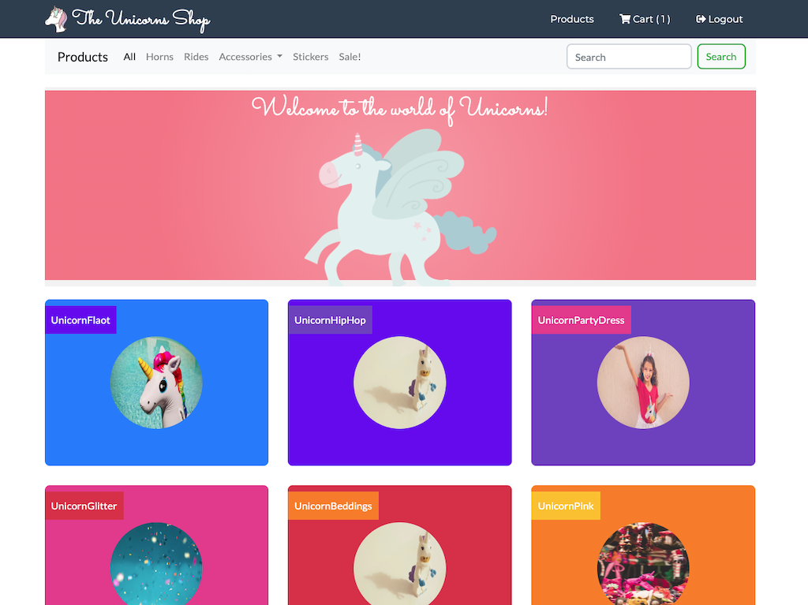
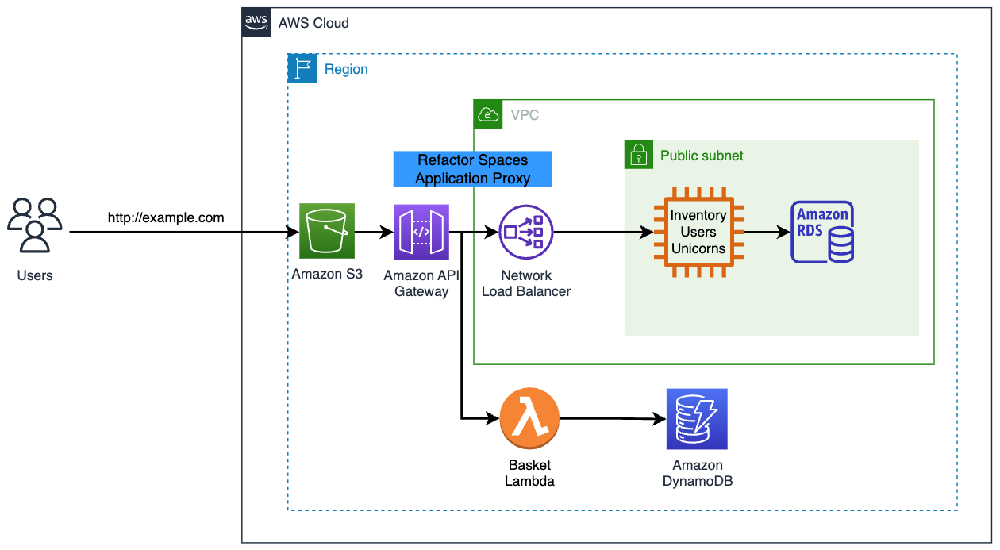
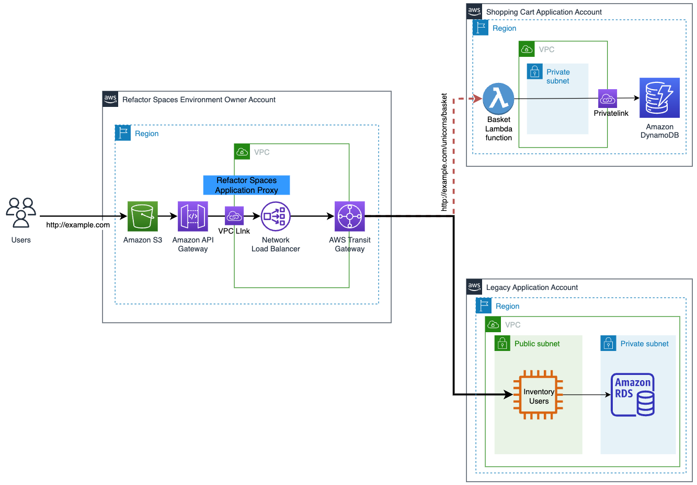

# <p align="center">AWS 마이그레이션 허브 리팩터 스페이스 워크샵 소개</p>



---

## 배경

`Unishop`은 필요한 유니콘을 입양할 수 있는 원스톱 쇼핑몰입니다. `Unishop`에서는 다양한 유니콘을 찾아보고, 24시간 이내에 유니콘을 전달받을 수 있습니다! 그러나 현재의 `모노리식` 아키텍처는 비즈니스 확장에 따른 성장을 어렵게 만듭니다. CTO는 `Strangler Fig 패턴`을 사용하여 `Unishop`을 마이크로서비스 아키텍처로 이전하는 것을 탐색하고 싶어합니다.

---

## `AWS Migration Hub Refactor Space`

우리는 `AWS Migration Hub Refactor Space`를 사용하여 마이크로서비스 기반 아키텍처로의 점진적인 전환을 단순화하고 가속화할 것입니다. `Refactor Spaces`를 사용하면, 리팩토링에 필요한 기본 인프라의 생성 및 관리가 아닌 애플리케이션의 리팩토링에 집중할 수 있습니다.

이 워크숍은 단일 계정에서 진행되지만, `Refactor Spaces`는 다중 계정 환경에서 리팩토링을 점진적으로 단순화하는 과정도 지원합니다. 여러 AWS 계정을 사용하는 것은 `비용 가시성`, `보안 격리`, `팀 자율성`을 가능하게 하는 모범 사례입니다. `Refactor Spaces`는 두 가지 주요 리소스를 통해 다중 계정 리팩토링을 단순화합니다:

* `Refactor Spaces 환경 (Environment)` — `Refactor Spaces 환경`은 다른 `Refactor Spaces` 리소스의 논리적 구분 단위이며, 점진적으로 현대화하는 데 필요한 인프라, 다중 계정 네트워킹, 라우팅을 제공합니다. `환경`은 선택적으로 `Transit Gateway`와 `VPC`를 조정하여 AWS 계정 간의 네트워킹을 연결하고, 레거시 서비스와 새로운 서비스가 직접 통신할 수 있게 합니다.
* `Refactor Spaces 애플리케이션 (Application)` — `애플리케이션`은 `API Gateway`, `VPC Link`, `리소스 정책`을 배포하고 관리하여 새로운 서비스로 트래픽을 투명하고 점진적으로 라우팅할 수 있게 합니다. 이는 기본 아키텍처 변경을 애플리케이션 사용자에게 투명하게 유지합니다.

---

## 다룰 내용들

이 워크샵은 모놀리식 애플리케이션을 마이크로서비스 기반 애플리케이션으로 전환하는 과정을 쉽게 따라하고 이해할 수 있도록 구성되어 있습니다.

```모듈 1```에서는 모놀리식 애플리케이션에 대해 다룹니다. 이는 전통적인 `Spring Boot Java` 애플리케이션으로, `EC2 인스턴스`에 배포되고 `RDS MySQL 데이터베이스`에 연결됩니다. `프론트엔드`는 `S3 정적 웹 호스팅` 기능을 통해 호스팅되며, 이는 성장하는 요구 사항을 충족시키기 위해 자동으로 확장되는 간단하면서도 강력한 호스팅 솔루션입니다.

```모듈 2```에서는 `AWS Migration Hub Refactor Space`를 사용하여 리팩터링 환경을 생성하고, 이를 통해 레거시 애플리케이션에서 `AWS Lambda`와 `Amazon DynamoDB`를 백엔드로 하는 새로운 `쇼핑 카트` `마이크로서비스`로 트래픽을 간단하게 라우팅합니다.

다음 컴포넌트들이 `Refactor Spaces`를 사용하여 생성됩니다:

* ```Refactor 환경 (Environment)``` - `Refactor Space 환경`은 여러 AWS 계정에 걸친 네트워킹, 애플리케이션, 서비스에 대한 통합 뷰를 제공합니다. 이 워크샵에서는 구성을 단순화하고 개념에 집중하기 위해 단일 계정을 사용합니다.
* ```애플리케이션 (Application)``` - `Refactor Space 애플리케이션`은 `서비스`와 `라우트`를 포함하며, 애플리케이션을 외부 호출자에게 노출하는 `단일 외부 엔드포인트`를 제공합니다. 또한 `애플리케이션`은 점진적인 애플리케이션 리팩토링을 위한 `Strangler Fig 프록시`를 제공합니다.
* ```서비스 (Services)``` - `Refactor Space 서비스`는 애플리케이션의 비즈니스 기능을 제공하며 고유한 엔드포인트를 통해 접근할 수 있습니다. `서비스 엔드포인트`는 다음 두 가지 유형 중 하나입니다: `HTTP/HTTPS URL` 또는 `AWS Lambda 함수`
* ```라우트 (Routes)``` - `Refactor Space 라우트`는 요청을 서비스로 전달하는 프록시 매칭 규칙입니다. 각 요청은 `애플리케이션`에 구성된 `라우트 집합`에 대해 실행됩니다. 규칙이 일치하면 요청이 해당 규칙에 대해 구성된 대상 서비스로 전송됩니다.

```모듈 3```에서는 새로운 `마이크로서비스`를 구현하고, 이를 통해 레거시 `장바구니` 기능을 대체하는 새로운 `DynamoDB 테이블`과 `Lambda 코드`를 구성합니다. 그런 다음 `서비스`를 구성하고 새로운 마이크로서비스로 `라우트`를 설정합니다.

마이크로서비스 아키텍처로 이동하는 주요 이점 중 하나는 각 마이크로서비스를 사용 사례에 가장 적합한 기술 스택을 사용하여 개발할 수 있다는 것입니다. 이 워크샵은 ```Unishop```의 `장바구니` 기능의 컴퓨트 및 데이터베이스 기능으로 `AWS Lambda`와 `Amazon DynamoDB`를 사용하기로 결정했습니다.

---

## 아키텍처

### `AS-IS` 아키텍처
현재의 아키텍처는 단일 `VPC`와 단일 `가용 영역` 내에 위치한 EC2 인스턴스를 활용합니다. 마찬가지로, RDS 인스턴스도 단일 가용 영역 내에 위치하게 됩니다.


데이터베이스는 `RDS MySQL`를 사용하도록 구성되었으며, `프론트엔드`는 `S3`에 정적 웹 호스팅되어 있습니다.

### `TO-BE` 아키텍처
`TO-BE` 아키텍처는 `Refactor Spaces`를 사용합니다. 우리의 목표는 `Refactor Spaces`를 사용하여 `장바구니`의 `라우트`를 새로운 마이크로서비스로 전환하는 것입니다.



`Refactor Spaces` `모범 사례` (`Best Practices`)는 인프라와 마이크로서비스를 다음과 같이 각자의 계정에 배포하는 것입니다 (`Refactor Spaces 환경`을 다른 계정과 공유하는 내용은 [[Share your environment]](https://docs.aws.amazon.com/migrationhub-refactor-spaces/latest/userguide/getting-started-share-environment.html) 문서에서 찾을 수 있습니다). 그러나 이 워크샵에서는 단일 계정을 사용하는 더 간단한 아키텍처로 구현하겠습니다.


