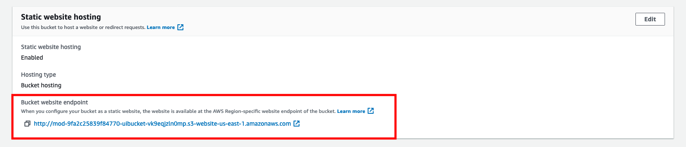

# <p align="center">`모놀리스 (Monolith)` 애플리케이션</p>

이 모듈에서는 `Unishop` 레거시 애플리케이션을 알아보도록 하겠습니다.


해당 애플리케이션은 `Spring Boot` 부트스트랩을 사용하는 `Java` 애플리케이션입니다. 이 백엔드 애플리케이션은 `MySQL` 데이터베이스에 연결된 단일 `EC2 인스턴스`에 배포됩니다. 프론트엔드 웹사이트는 `Amazon S3 정적 웹 호스팅`을 사용하여 호스팅됩니다.

`CloudFormation`을 사용하여 `레거시 모놀리스` 자원을 배포하도록 하겠습니다.

---

## `모놀리스 애플리케이션` 자원 배포

`AWS Cloud9` 환경에서 `CloudFormation`을 사용하여 `모놀리스 애플리케이션` 자원을 배포합니다.

```bash
# CloudFormation 디렉토리로 이동
cd ~/environment/refactor-workshop/infrastructure-cloudformation

# 레거시 모놀리스 CloudFormation 스택 배포
aws cloudformation deploy --stack-name legacy-monolith \
    --template-file ./legacy-monolith.yaml \
    --capabilities CAPABILITY_NAMED_IAM
```

---

## `백엔드 애플리케이션` 확인

아래 순서로 `백엔드 애플리케이션`의 URL을 사용하여 `요청`을 생성하고 관련 `응답`을 확인해 보도록 하겠습니다.

1. `AWS 콘솔`에 로그인되어 있는지 확인합니다.<br>

2. `CloudFormation` 서비스 페이지에서 `설명 (Description)`이 `Monolith stack ~`으로 시작하는 `Monolith 스택`을 클릭합니다.<br>

3. `출력 (Outputs)` 탭을 클릭합니다.<br>

4. `PublicDns` 값을 복사합니다.<br>
   * 이 값은 `Unishop` 애플리케이션을 실행하는 `EC2 인스턴스`의 `DNS 이름`입니다. 이 `DNS 이름`은 `Refactor Spaces`와 `API Gateway`를 구성하는 데 사용하므로 이 DNS 값을 기록해 두도록 합니다.
      

5. `Unishop` 백엔드 애플리케이션을 호출합니다. 브라우저를 열고 경로 `/unicorns`가 추가된 `PublicDns` 값을 주소 입력란에 붙여 넣습니다 (예: http://ec2-XXX-XXX-XXX-XXX.compute-1.amazonaws.com/unicorns).

또는 커맨드 라인 상에서 `curl` 명령을 사용할 수 있습니다. 아래 이미지와 유사한 응답을 받아야 합니다.

> HTTP (HTTPS가 아님)를 사용하고, 복사한 URL의 끝에 /unicorns를 추가하는 것을 잊지 마세요.


이제 백엔드(Java Spring Boot 애플리케이션)가 검증되었으므로, S3 정적 웹사이트 호스팅을 사용하여 프론트엔드를 확인해 봅시다.

---

## `프론트엔드 웹사이트` 확인

이번에는 아래와 같은 사항을 수행해 보도록 하겠습니다.

* 웹사이트 URL 확인하기
* 이메일 주소를 사용하여 등록하기
* 쇼핑 카트에 아이템을 추가하고 사용자를 식별하는 `UUID` 확인하기

`프론트엔드` 웹사이트는 `Amazon S3 정적 웹 호스팅` 기능을 사용하여 호스팅됩니다. 이는 간단하면서도 강력한 호스팅 솔루션으로, 성장하는 요구 사항을 충족시키기 위해 자동으로 확장됩니다.

1. `Amazon S3`로 이동하여 `CloudFormation`이 생성한 `STACK-NAME-uibucket-xxxxx`라는 이름의 버킷을 클릭합니다 (`xxxxx`는 `CloudFormation`이 생성한 랜덤 문자열입니다).

2. `속성 (Properties)` 탭을 선택하고 `정적 웹사이트 호스팅 (Static Website Hosting)`으로 스크롤합니다.

3. `버킷 웹 사이트 엔드포인트` URL을 클릭합니다.


4. 유니콘들이 `Unishop` 랜딩 페이지에 표시됩니다.


5. 사용자 등록을 합니다.
   1. 애플리케이션에 사용자로 등록합니다. 이메일만 제공하면 됩니다 (유효한 이메일일 필요는 없습니다). 이름이나 비밀번호도 입력할 필요가 없습니다. 등록에 사용한 이메일은 이후 과정에 사용되므로 기록해 두시기 바랍니다.
   2. 브라우저의 `개발자 도구` > `콘솔`에서 출력을 확인합니다. 다음과 같은 내용을 얻게 됩니다:
   > { uuid: "f031e124-f75a-4112-1234-78abbcc9d070", email: "<제공된 이메일>" } "User Signed Up"

   3. 이 `UUID`를 기록해 두십시요. 이 정보는 사용자와 장바구니를 식별하는 데 사용됩니다. 
   4. 애플리케이션에 로그인합니다. 가입 시 사용한 이메일만 입력하면 됩니다, 비밀번호는 필요하지 않습니다. 브라우저 개발자 콘솔에 `[] "Got the cart"` 메시지가 표시되는지 확인합니다. 
   5. 쇼핑 카트에 아이템을 추가/삭제해 봅니다. 브라우저의 콘솔에서 출력을 확인합니다. 참고로 각 아이템은 하나만 추가할 수 있습니다.

---

## 애플리케이션 리뷰

우리는 `Unishop` 모놀리식 애플리케이션을 배포하였고 잘 동작함을 확인하였습니다.<br>
이제 마이크로서비스 아키텍처로 배포하고 라우팅할 준비가 되었습니다.

현재 `Unishop` 애플리케이션은 6개의 컨트롤러를 가지고 있으며, 이들은 `RDS MySQL 데이터베이스`의 3개 테이블을 사용합니다.


컨트롤러에는 아래와 같이 6개가 구현되어 있는데, 진행자와 함께 살펴보셔도 좋습니다.

* `CoreController`: 기본 컨트롤러 (현재는 구현되어 있지 않음)
* `BasketController`: 장바구니 관리
* `UnicornController`: 재고 관리
* `UserController`: 사용자 등록, 로그인 및 관리
* `HealthController`: `Health Check` 엔드포인트 컨트롤러
* `DataReplicationController`: 데이터 복제 수행

```bash
cd ~/environment
git clone --single-branch --branch v8 https://github.com/aws-samples/unishop-monolith-to-microservices.git MonoToMicro

cd ~/environment
c9 open MonoToMicro/MonoToMicroLegacy/src/main/java/com/monoToMicro/rest/controller/BasketController.java
```


테이블에는 다음과 같이 3개가 사용됩니다.
* `unicorns`: 유니콘의 재고를 보유
* `unicorn_basket`: 사용자가 장바구니에 등록한 유니콘 테이블
* `unicorn_user`: 사용자 테이블

```bash
cd ~/environment
c9 open MonoToMicro/MonoToMicroLegacy/database/create_tables.sql
```

우리의 목표는 레거시 앱의 `BasketController` 기능과 그것이 사용하는 `unicorn_basket` 테이블을 대체할 수 있는 새로운 `마이크로서비스`를 배포하는 것입니다. 마이크로서비스는 `DynamoDB`를 데이터베이스로 사용하는 `AWS Lambda`를 통해 구현될 것입니다.

`Stranger Fig 패턴`을 적용하기 위해서는, `쇼핑 카트` 트래픽을 `레거시 애플리케이션`에서 새로운 `마이크로서비스`로 리디렉션하는 방법이 필요합니다. 이때 `Refactor Spaces`를 활용하여 `API Gateway`의 `Lambda 통합`을 조정함으로써 `라우팅`을 단순화합니다.
